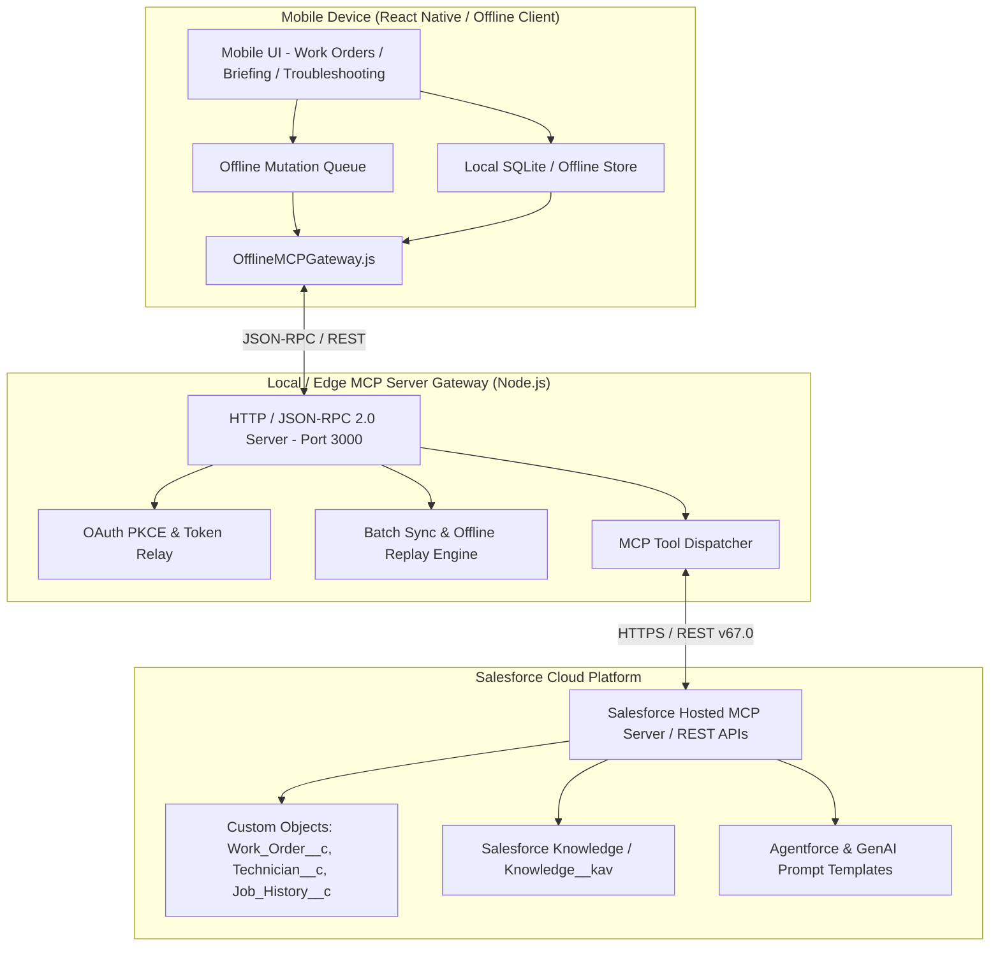

# digiField360 Mobile Application & MCP Server Specification

## 1. Executive Summary & Objective

**digiField360** is an enterprise field service operations platform built on Salesforce Lightning Platform and Agentforce. Field technicians operating in India and Southeast Asia frequently face unstable or non-existent cellular connectivity during on-site equipment repairs (basements, industrial plants, rural sites).

The **digiField360 Mobile Application & Server Gateway** provides an **offline-first, AI-assisted mobile experience** for technicians. It enables seamless job execution, morning cache pre-loading, offline mutation queuing, AI troubleshooting guidance, GPS tracking, and automatic service report generation upon job completion.

---

## 2. System Architecture & Topology



---

## 3. Functional Requirements

### 3.1 Morning Pre-Load & Cache Sync
- **Requirement**: When a technician starts their shift, the mobile app downloads:
  - All assigned `Work_Order__c` records for today.
  - Equipment records and the last 5 `Job_History__c` records per equipment.
  - Pre-generated AI Pre-Job Briefings (`AI_Pre_Job_Briefing__c`).
  - Top troubleshooting Knowledge articles for the assigned equipment types.
  - SObject schema definitions (`sobject_describe`) for offline input validation.

### 3.2 Offline Mutation Queue & Synchronization
- **Requirement**: While offline, technicians can:
  - Change Work Order status (`In Progress`, `Completed`).
  - Log hours worked and parts used.
  - Enter technician resolution notes.
  - Capture photo attachment metadata (`ContentVersion`).
- **Sync Mechanism**: Every mutation is stamped with a UUID (`Offline_Queue_ID__c`) and timestamp. Once connectivity is restored, the `OfflineMCPGateway` replays mutations sequentially to the MCP Server, which executes Salesforce updates and reconciles timestamps (`Last_Synced__c`).

### 3.3 On-Site AI Troubleshooting Assistant
- **Requirement**: Technicians can type or voice-dictate symptoms (e.g. *"compressor not starting after oil change"*).
- If online: Calls `F360_TroubleshootingAction` / `sobject_search` via MCP for real-time LLM diagnostic guidance in technician's preferred language (en, hi, mr, ta, te).
- If offline: Searches local Knowledge cache for matching diagnostic checklists.

### 3.4 Job Completion & Service Report Generation
- **Requirement**: Upon completing a job, the technician confirms notes and parts used.
- Trigger `F360_ServiceReportAction` via MCP Server.
- Save report to `AI_Service_Report__c` and create a `ContentVersion` PDF attachment.

### 3.5 GPS Location & Technician Telemetry
- **Requirement**: Mobile device periodically sends GPS coordinates (`Current_Latitude__c`, `Current_Longitude__c`) to optimize dispatch routing and smart assignment calculations.

---

## 4. MCP Server Tool Protocols & Specifications

The Mobile Server Gateway implements JSON-RPC 2.0 endpoints supporting both individual tool calls and batch sync operations:

### 4.1 `sobject_query`
- **Purpose**: SOQL query execution for morning pre-load and delta sync.
- **Input**: `{ "soql": "SELECT Id, Subject__c, Status__c, Priority__c, Equipment_Type__c, Equipment_ID__c, Site_Address__c, AI_Pre_Job_Briefing__c FROM Work_Order__c WHERE Status__c IN ('Assigned', 'In Progress')" }`
- **Output**: JSON array of matching records with pagination metadata.

### 4.2 `sobject_search`
- **Purpose**: SOSL / Knowledge base search for troubleshooting.
- **Input**: `{ "searchTerm": "compressor tripping breaker", "sobjectName": "Knowledge__kav" }`
- **Output**: Ranked knowledge articles, diagnostic steps, and senior escalation flags.

### 4.3 `sobject_update`
- **Purpose**: Updating work order status, technician notes, parts used, completion dates.
- **Input**:
  ```json
  {
    "sobjectName": "Work_Order__c",
    "recordId": "a00000000000WO1",
    "fields": {
      "Status__c": "Completed",
      "Technician_Notes__c": "Replaced faulty capacitor and calibrated motor speed.",
      "Parts_Used__c": "Capacitor 45MFD (1x)",
      "Time_Logged_Minutes__c": 90,
      "Completed_Date__c": "2026-08-21T10:00:00Z"
    }
  }
  ```
- **Output**: `{ "success": true, "id": "a00000000000WO1" }`

### 4.4 `sobject_create`
- **Purpose**: Creating `Job_History__c` records, time logs, or `ContentVersion` attachments.
- **Input**:
  ```json
  {
    "sobjectName": "Job_History__c",
    "fields": {
      "Work_Order__c": "a00000000000WO1",
      "Equipment_ID__c": "EQ-4401",
      "Equipment_Type__c": "Generator",
      "Technician__c": "a010000000000T1",
      "Resolution_Notes__c": "Replaced faulty capacitor"
    }
  }
  ```
- **Output**: `{ "success": true, "id": "a020000000000H1" }`

### 4.5 `sobject_describe`
- **Purpose**: Schema introspection for dynamic mobile UI field validation.
- **Input**: `{ "sobjectName": "Work_Order__c" }`
- **Output**: Object label, field types, picklist values, required flags.

### 4.6 `process_offline_queue` (Batch Endpoint)
- **Purpose**: Replay an array of queued offline mutations atomically.
- **Input**:
  ```json
  {
    "technicianId": "a010000000000T1",
    "mutations": [
      {
        "queueId": "UUID-1001",
        "action": "update",
        "sobjectName": "Work_Order__c",
        "recordId": "a00000000000WO1",
        "fields": { "Status__c": "In Progress" },
        "queuedAt": "2026-08-21T08:30:00Z"
      },
      {
        "queueId": "UUID-1002",
        "action": "update",
        "sobjectName": "Work_Order__c",
        "recordId": "a00000000000WO1",
        "fields": { "Status__c": "Completed", "Technician_Notes__c": "Done" },
        "queuedAt": "2026-08-21T09:45:00Z"
      }
    ]
  }
  ```
- **Output**: Array of mutation results with success/failure status per queueId.

---

## 5. Security, OAuth & Token Lifecycle

1. **OAuth 2.0 PKCE Flow**:
   - `SF_OAUTH_CLIENT_ID`: Consumer Key from External Client App `digiField360_Mobile`.
   - `SF_OAUTH_CALLBACK_URL`: `field360://callback`
   - Scopes: `api`, `refresh_token`, `offline_access`
   - PKCE Code Verifier and Code Challenge SHA-256 validation.
2. **Token Storage**:
   - Access and refresh tokens stored securely on device using OS Keychain (iOS) / KeyStore (Android).
   - Silent auto-refresh handled by MCP Gateway on HTTP `401 Unauthorized`.

---

## 6. Mobile Application Screen Structure

| Screen Name | Purpose & Primary Actions |
| --- | --- |
| **Shift Dashboard** | Morning Pre-Load button, Shift Status, Today's Work Order List, Sync Status indicator |
| **Work Order Detail** | Job Details, Customer Contact, AI Pre-Job Briefing expandable card, Status change buttons |
| **Troubleshooting Hub** | Search bar, Voice input, Diagnostic steps card, Senior Technician escalation button |
| **Job Completion Form** | Hours worked picker, Parts used checklist, Technician notes textarea, Complete & Generate Report |
| **Offline Sync Manager** | List of pending offline mutations, Manual Sync Trigger, Last Synced timestamp |
